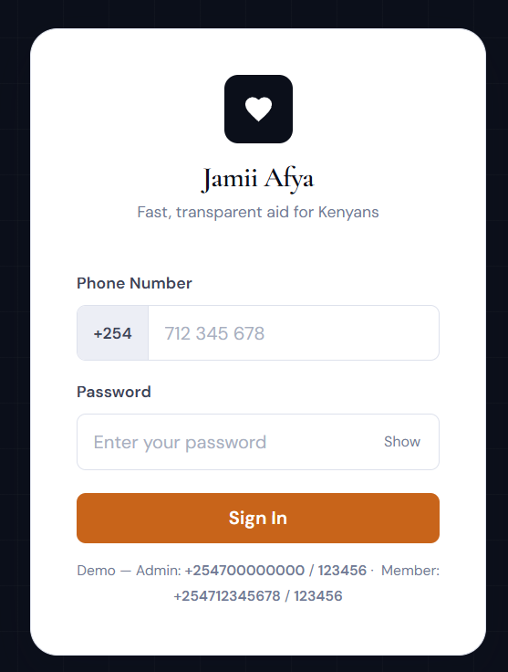
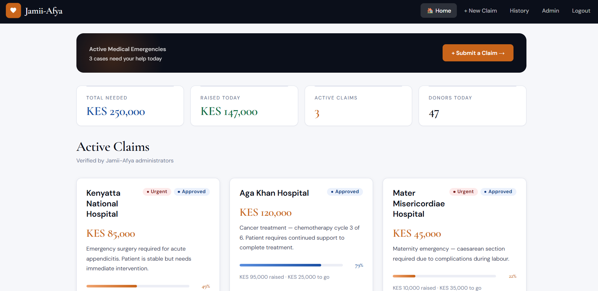
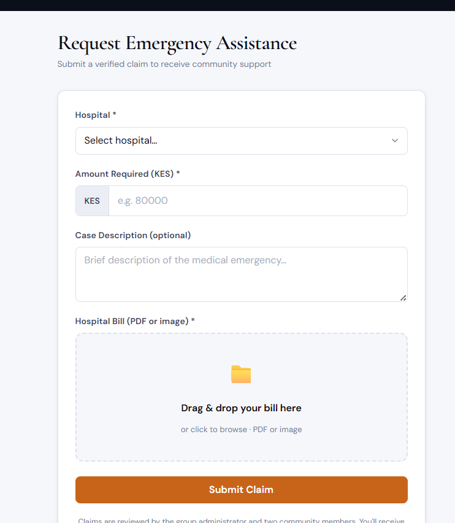
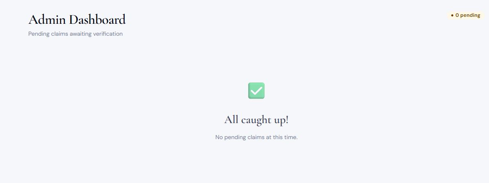
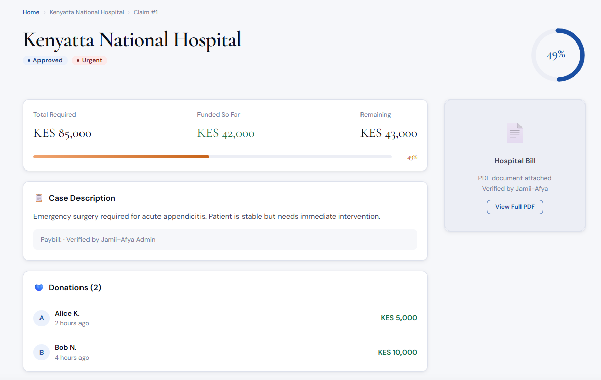

Jamii Afya

Jamii Afya is a community emergency medical support platform for small Kenyan communities. It helps members raise verified emergency requests, enables transparent group contributions, and uses M-Pesa + SMS notifications for fast, accountable assistance.


Problem and Solution

Problem
Community groups often support members during medical emergencies, but the process is usually manual and difficult to audit:
- Requests are shared in chats without structured evidence
- Decisions are unclear or delayed
- Contributions are not consistently tracked
- Members have low visibility into request status and payouts

Solution
Jamii Afya provides an end-to-end digital workflow:
- Members submit emergency requests with supporting documentation
- Group admins vote to approve or reject requests
- Contributions and emergency disbursements are integrated with M-Pesa
- Members receive SMS/in-app updates and can track progress transparently


About the App

Jamii Afya is designed to make emergency support in community groups faster, fairer, and traceable.

Core capabilities:
- User registration, login, and profile management
- Group creation and invite-code based joining
- Emergency request submission with document attachments
- Admin voting workflow with threshold-based decisions
- M-Pesa contribution initiation and payout processing
- Notification and audit support for accountability


Key Features (Screenshots)


1) Login / Authentication


2) Emergency Requests Dashboard


3) New Emergency Request Form


4) Admin Review and Voting


5) Contributions / Payment Flow


---

 Live Demo / Build Access (Mandatory)

- Web Demo URL: `https://jamii-afya-fan1.vercel.app/`


### Test Accounts (Multi-role)

Use the following accounts to test role-based flows:

| Role | Phone / Username | Password | Notes |
|------|-------------------|----------|-------|
| Admin | +254700000000 | 123456 | Can review and vote on emergencies |
| Member | +254712345678 | 123456 | Can submit emergency requests |

---

Tools, Technologies, and Frameworks

Frontend
- React 19
- Vite
- React Router
- Axios
- MUI (Material UI) + Emotion
- React Hook Form + Yup
- ESLint + Prettier
- Jest + Testing Library
- MSW (for API mocking during tests/dev)

Backend
- Django
- Django REST Framework
- JWT authentication (`djangorestframework-simplejwt`)
- MySQL
- Redis
- Celery + django-celery-beat
- `drf-spectacular` (OpenAPI/Swagger docs)
- `django-cors-headers`
- `python-decouple`
- `requests`
- `Pillow`

Integrations
- Safaricom M-Pesa (STK/B2C flows)
- CommsGrid SMS


Project Structure

```text
jamii-afya/
├── backend/      # Django API, business logic, async workers
├── frontend/     # React web client
└── README.md     # Project documentation (this file)
```


Local Setup (Quick Start)

Detailed setup guides:
- Backend setup: `backend/README.md`
- Frontend setup: `frontend/README.md` 

Typical run sequence:
1. Start backend API
2. Start Celery worker (and beat if needed)
3. Start frontend app
4. Open the frontend URL in browser


API Documentation

When backend is running locally:
- Swagger UI: `http://127.0.0.1:8000/api/docs/`
- OpenAPI schema: `http://127.0.0.1:8000/api/schema/`

Contributors

Raymond Munguti · raymondmunguti163@gmail.com  · 0782280375 (Backend)

Ian Mwirigi · ianmwirigi@outlook.com  · 0714225936 (Frontend)

Joy Chepkorir Bett · cjoybett@gmail.com  · 0700024985 (Fullstack)

Debora Chepkemoi · deemems3755@gmail.com  · 0715152711 (Frontend)

Vanessa Kittivo · kittivovanessa@gmail.com  · 0708522455 (Data Analytics)

Abdulrahman Echwa · abdulrahmanali2160@gmail.com  · 0734993126 (Cybersecurity)


